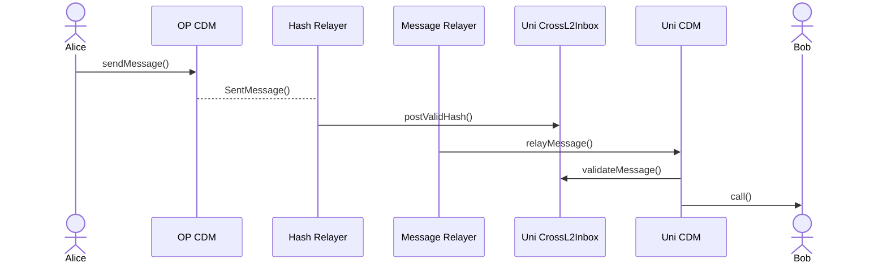
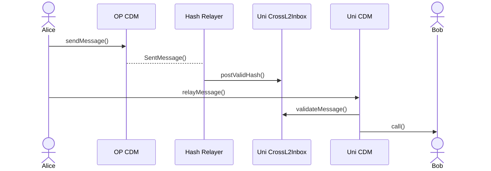

# Mock Interop Sepolia

<dl>
The Interoperability Mock System serves as a sandbox for emulating cross-chain interactions. The system replicates how messages move across chains and verifies the integrity of this communication through permissioned relayers, which are trusted entities managed by the contract owner(s).
</dl>

## Disclaimer

The following contracts are __not intended for use in production environments__. Please exercise caution and conduct thorough due diligence before utilizing them.

## Setup

1. Install Foundry by following the instructions from [their repository](https://github.com/foundry-rs/foundry#installation).
2. Copy the `.env.example` file to `.env` and fill in the variables.
3. Install the dependencies by running: `yarn install`. In case there is an error with the commands, run `foundryup` and try them again.

## Build

The default way to build the code is suboptimal but fast, you can run it via:

```bash
yarn build
```

In order to build a more optimized code ([via IR](https://docs.soliditylang.org/en/v0.8.15/ir-breaking-changes.html#solidity-ir-based-codegen-changes)), run:

```bash
yarn build:optimized
```

## Running tests

Unit tests should be isolated from any externalities, while Integration usually run in a fork of the blockchain. In this boilerplate you will find example of both.

In order to run both unit and integration tests, run:

```bash
yarn test
```

In order to just run unit tests, run:

```bash
yarn test:unit
```

In order to run unit tests and run way more fuzzing than usual (5x), run:

```bash
yarn test:unit:deep
```

In order to just run integration tests, run:

```bash
yarn test:integration
```

In order to check your current code coverage, run:

```bash
yarn coverage
```

<br>

## Deploy & verify

Note: In order to deploy contracts with the same address in every chain is important to use the same `SALT` and `DEPLOYER` for every deployment.

### OP Sepolia

```bash
yarn deploy:optimism:sepolia
```

### Unichain Sepolia

```bash
yarn deploy:unichain:sepolia
```

## Deployed Contracts by Wonderland

### 🔴 Optimism Sepolia

**CrossL2Inbox**: https://sepolia-optimism.etherscan.io/address/0x20fce9a9c640bd99a0edb14613356cf8d54c2bb3

**L2ToL2CrossDomainMessenger**: https://sepolia-optimism.etherscan.io/address/0x16cb4762e5f36f0cf5d8503a0771f048c9f8c460

### 🦄 Unichain Sepolia

**CrossL2Inbox**: https://unichain-sepolia.blockscout.com/address/0x20FcE9A9c640bd99a0eDB14613356cf8D54C2BB3

**L2ToL2CrossDomainMessenger:** https://unichain-sepolia.blockscout.com/address/0x16cB4762e5f36f0cF5D8503A0771f048C9f8c460

### 🥎 Mode Sepolia

**CrossL2Inbox:** https://sepolia.explorer.mode.network/address/0x20FcE9A9c640bd99a0eDB14613356cf8D54C2BB3

**L2ToL2CrossDomainMessenger:** https://sepolia.explorer.mode.network/address/0x16cB4762e5f36f0cF5D8503A0771f048C9f8c460

## Upgrade

Contracts are UUPS proxies and can be upgraded calling the following function from Owner's account:

```solidity
function upgradeToAndCall(address newImplementation, bytes memory data)
```


## Usage Guide

### Messaging

**With sponsored relay**



**Without sponsored relay**



As illustrated in the diagram, four core components are required:

- `L2ToL2CrossDomainMessenger` emits a `SentMessage` event.
- `Hash Relayer` listens for the `SentMessage` event and posts a `hash` on `CrossL2Inbox`.
- `Message Relayer` or an EOA calls `relayMessage()` on `L2ToL2CrossDomainMessenger`.
- `CrossL2Inbox` is used by `L2ToL2CrossDomainMessenger` to verify that the message is valid.

**Sending Message**

On `L2ToL2CrossDomainMessanger` from Origin Chain:

1. User calls `sendMessage(uint256 _destination, address _target, bytes calldata _message) external returns (bytes32 hash_)`
    1.1. `_destination` is the ID of the destination chain.
    1.2. `_target` is the address that will receive the `_message`.
    1.3. `_message` encoded call.
2. Contract emits `SentMessage(_destination, _target, nonce, **msg.sender**, _message);`

**Posting Hash on Destination**

With a service listening at `L2ToL2CrossDomainMessenger` events from origin chain, when a `SentMessage` event is emitted this service should use the log topics, log data and blockchain data to generate a hash. 

1. Generate hash
    
    **Message Hash:** is composed by log topics encoded, log data encoded and the `keccak256` of the `SentMessage` signature.
    
    ```solidity
    keccak256(
    	abi.encodePacked(
    		keccak256('SentMessage(uint256,address,uint256,address,bytes)'),
    		abi.encode(_destination, _target, _nonce),
    		abi.encode(_sender, _message)
    	)
    );
    ```
    
    ```bash
    > cast keccak256 'SentMessage(uint256,address,uint256,address,bytes)'
    0x382409ac69001e11931a28435afef442cbfd20d9891907e8fa373ba7d351f320
    ```
    
    **Identifier:** is a struct that uses blockchain data. `origin` in this case the address of the `L2ToL2CrossDomainMessenger`.
    
    ```solidity
    struct Identifier {
      address origin;
      uint256 blockNumber;
      uint256 logIndex;
      uint256 timestamp;
      uint256 chainId;
    }
    ```
    
    **Hash:** this is the hash that will be posted on the destination chain.
    
    ```solidity
    bytes32 _hash = keccak256(abi.encode(_id, _msgHash));
    ```
    
2. Call `postValidHash()` in `CrossL2Inbox` using the relayer’s address that has been previously enabled in `CrossL2Inbox`.

**Relaying Message**

Here we have two options:

1. With sponsored relay, once the hash is posted, a Message Relayer that is listening `RegisteredHash()` events can call `relayMessage(Identifier calldata _id, bytes calldata _sentMessage)` function on the destination chain `L2ToL2CrossDomainMessenger` using the same data that was used to post the hash.
2. Without sponsored relay, the user can call `relayMessage(Identifier calldata _id, bytes calldata _sentMessage)` in the same way the relayer does.

It's important to note that whether or not relaying is sponsored, the system will always require that the relayer posts the hash before the relay happens.

---

### Enable a Relayer

Owner of `CrossL2Inbox`, as the system administrator, can approve new relayers to join the list of trusted entities for message transmission across the network by calling `enableRelayer()` function.

### Disable a Relayer

If a relayer no longer meets the trust requirements or wants to stop acting as one, Owner of `CrossL2Inbox` has the authority to revoke its access and remove it from the approved relayers list.

## Licensing
The primary license for the boilerplate is MIT, see [`LICENSE`](https://github.com/defi-wonderland/mock-interop/blob/main/LICENSE)